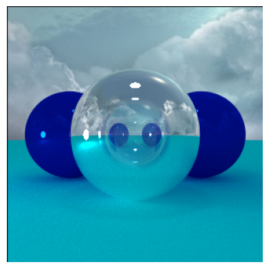

# Pretty Fast Python Path Tracer

Python path tracer using [Numba](https://github.com/numba/numba) for acceleration. 

## Features
### Light Transport
- [x] Diffusion
- [x] Reflection
- [x] Specular Highlights
- [x] Refraction
- [ ] Caustics

### Geometry
- [x] Spheres
- [ ] Polygon Meshes (obj format) 
